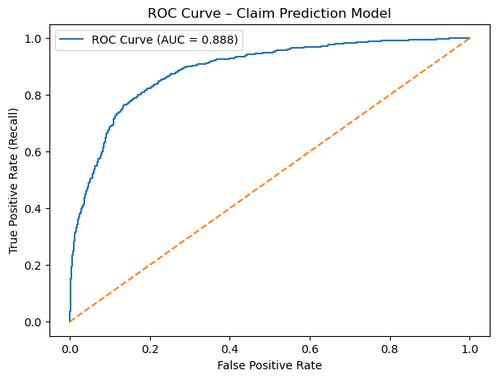
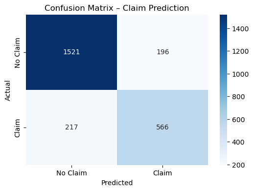
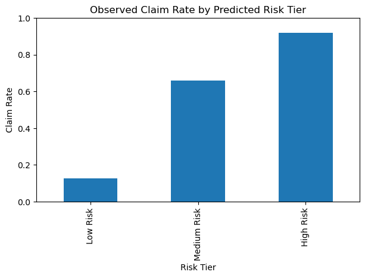
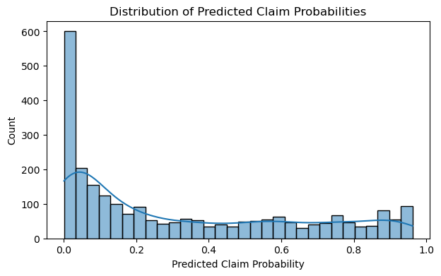

# Modeling Car Insurance Claim Outcomes  
Auto Insurance Risk Modeling with Logistic Regression

## Overview
This project analyzes auto insurance policy data to predict whether a policyholder will file a claim during the policy period. The objective is to move beyond raw prediction accuracy and instead build an interpretable, underwriting-focused risk model that supports pricing decisions, loss control, and risk segmentation.

The analysis follows a practical insurance analytics workflow:  
Python → Logistic Regression → Risk Tier Segmentation → Business Interpretation

---

## Why This Project
In auto insurance, a relatively small portion of policyholders generate a disproportionate share of losses. Accurately identifying higher-risk policies at quote or renewal time is critical for:

- Pricing premiums appropriately  
- Reducing unexpected loss exposure  
- Avoiding adverse selection  
- Maintaining competitiveness for low-risk drivers  

This project prioritizes **interpretability and decision usability** rather than black-box prediction.

---

## Data Source
- Public auto insurance dataset (Kaggle)
- ~10,000 individual policies
- Binary claim outcome (`OUTCOME`)
- Variables reflecting real underwriting inputs:
  - Driver characteristics
  - Driving history
  - Vehicle attributes
  - Exposure measures (e.g., annual mileage)

---

## Modeling Approach
A Logistic Regression model was selected to ensure transparency and explainability.

Key steps:
1. Data cleaning and preprocessing  
2. One-hot encoding of categorical underwriting variables  
3. Stratified train/test split to preserve claim rates  
4. Median imputation for missing numeric fields  
5. Feature scaling for continuous variables  
6. Probability-based evaluation using ROC-AUC  
7. Risk tier segmentation based on predicted claim probability  

The model outputs **claim probabilities**, enabling flexible underwriting thresholds rather than rigid classifications.

---

## Model Performance & Risk Separation

### ROC Curve (Ranking Power)


The model achieves strong discriminatory power (ROC-AUC ≈ 0.89), indicating effective ranking of policyholders by claim risk.

---

### Confusion Matrix (Decision Trade-offs)


False negatives represent unpriced loss exposure, while false positives represent potential customer friction. From an insurance perspective, the model prioritizes capturing high-risk policies without excessive over-flagging.

---

### Claim Rate by Risk Tier (Key Business Result)


Policyholders were segmented into three risk tiers based on predicted claim probability:

| Risk Tier | Observed Claim Rate |
|----------|--------------------|
| Low Risk | ~13% |
| Medium Risk | ~66% |
| High Risk | ~92% |

Relative to the overall portfolio claim rate (~31%), the highest-risk segment shows nearly **3× lift**, demonstrating strong underwriting value.

---

### Predicted Probability Distribution


The distribution shows clear separation between low- and high-risk policies, supporting tier-based decisioning rather than a single cutoff.

---

## Business Interpretation
- **High Risk policies (top ~10%)**: underwriting review, pricing adjustments, or coverage restrictions  
- **Medium Risk policies**: moderate pricing changes or increased monitoring  
- **Low Risk policies**: preferred pricing and retention strategies  

This tiered framework allows insurers to reduce loss exposure while maintaining competitiveness for low-risk customers.

---

## Portfolio Context
This project demonstrates:
- Practical insurance risk modeling
- Comfort with imbalanced classification problems
- Emphasis on interpretability over black-box accuracy
- Ability to translate model outputs into underwriting and pricing decisions

The focus is intentionally on **decision support**, not over-engineered modeling.

---

## Repository Structure

```
Car_Insurance_Claim_Outcomes/
│
├── data/
│   └── raw/
│       └── car_insurance_claims.csv
│
├── notebooks/
│   └── 01_data_load_and_eda.ipynb
│
├── reports/
│   └── figures/
│       ├── roc_curve.png
│       ├── confusion_matrix.png
│       ├── claim_rate_by_risk_tier.png
│       └── predicted_probability_distribution.png
│
├── models/
├── src/
└── README.md
```
---

## Tools Used
- Python (pandas, numpy)
- scikit-learn
- matplotlib & seaborn
- Jupyter Notebook

---

## Author
**Brian Buchanan**  
Finance & Data Analytics | Insurance Risk Modeling


